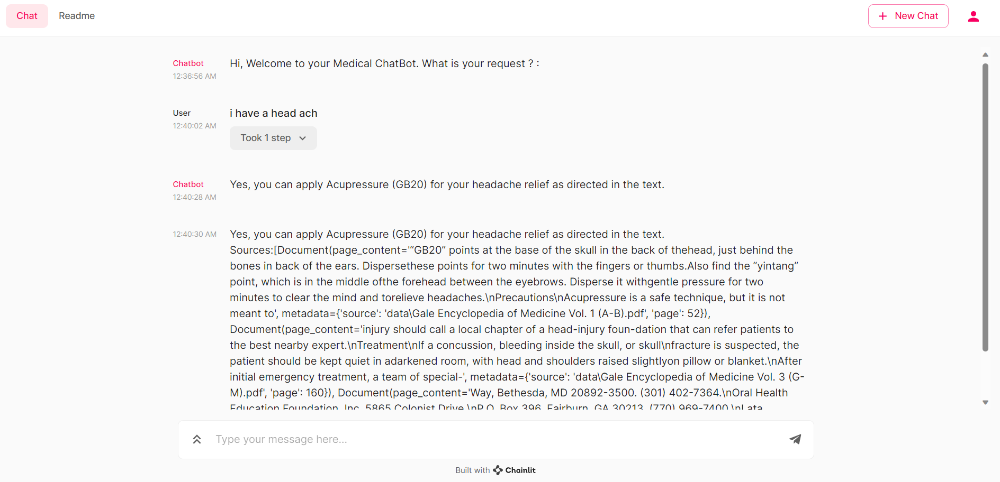

# medical_chatbot_llama2

In this project, I will be using Llama 2 to build a medical chatbot.

## What is Llama 2?

## What is a chatbot?

## 

Building the medical chatbot requires an llm model 
i am going to use llama2 but i can't just get it and use it. I need a quantized model. I will take it from TheBloke on HF.
- once downloaded we load it using Ctransformers (cpp) a python binding for transformers using cpp. 
- I will need also sentence transformers.
- Also vector database, i will use faiss cpu because i already have knowledge and experience using it. 

## Explaining the architecture (A simple one)

- 1. Loading the documents, splitting them into chucks of 512 tokens and then creating embeddings for them using HuggingFaceEmbeddings library (model_name : "sentence-transformers/all-MiniLM-L6-v2"). Then we store them in a vector database (faiss) for faster retrieval. I could be using Pinecone or any other such more highly available, production-grade VectorDBs instead. But since this is a demo, I am using faiss.
- 2. The user issues a prompt with the query/question.
- 3-4. We pass the query to the vectorB. Inside Faiss, we have the embeddings of the documents. We use the query embeddings to search for the most similar embeddings in the vectorDB. 
- 5. We retrieve the top-k chucks from the vectorDB.
- 6. We pass the top-k chucks to the llm model along with the query.
- 7. The llm model generates the answer.
  
# how to run
- first you need to download the model from HF\
- you need to put your data in the data folder
- run the ingest_data_VDB.py to ingest the data into the vector database and will in the folder vectorstores/db_faiss
- use chainlit to run the model
chainlit run chatbot.py

